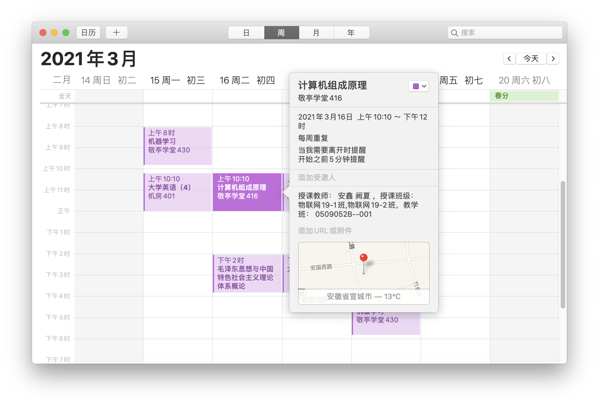

# 合工大课程日历助手

[Windows 可执行文件下载](https://github.com/KiMNOtri/hfutpluspy/releases/download/release/hfutpluspy_win.exe)
[源码下载](https://github.com/KiMNOtri/hfutpluspy/releases/download/release/hfutpluspyvfinal.zip)

将教务系统日历转换为 ICS 日历文件并导入至日历 APP，由 Python3 驱动。

## 使用须知
1. 从命令行形式启动 `main.py` ，初次使用请按照 `requirements.txt` 安装依赖库（依赖 requests 库）。
2. 支持 macOS/Windows/Linux
3. 合肥校区暂未测试。
4. 最好在校园网环境下使用。

## 功能
* 导出课表为 ics 文件，可导入至手机日历并添加提醒（课程开始前 5 分钟通知）
* 顺便查查成绩

## 免责声明
软件可能随时因为外部系统的变更而无法使用或者是功能异常，开发者会尽可能进行适配或者修复，但开发者没有义务维护和修复软件的功能。并且，软件随时可能因为个人原因或外部不可抗力而停止维护和更新，使用该软件意味着我已经知晓上述事实。

## 更新日志
全是负优化

